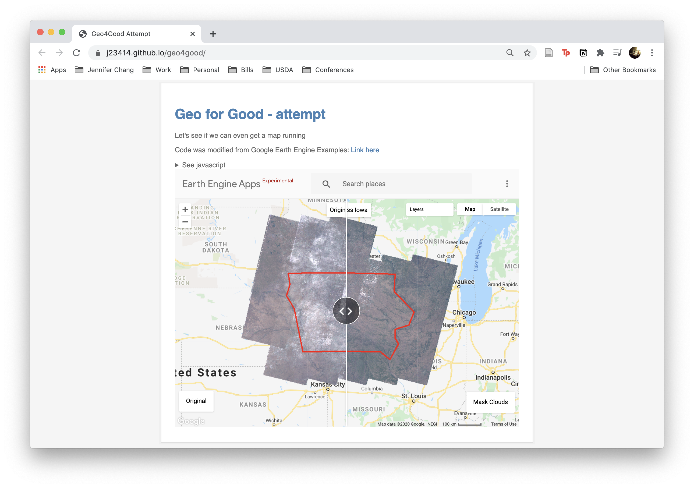

# geo4good
Prep for Geo for Good Summit, mostly a quick run through of online tutorials

* [9th Geo for Good Summit](https://earthoutreachonair.withgoogle.com/events/geoforgood20)
* [Google Earth Engine](https://earthengine.google.com/)
* You'll need to register a API key (and probably enter billing information, hopefully will get free trial to test it out first)
* Then restrict the API either by website or API(?), the dashboard walks through the steps

## Live Website 



Built via a combination of tutorials

* pull data (Landsat 8)
* subset to a polygon (Iowa)
* apply a mask (to remove clouds)
* and create a responsive view (split map to highlight difference between original vs cloudless Iowa). 

Future work could be 

* identifying regions of interest (vegetation, rivers/lakes, average cloud cover) 
* and time series analysis (flood changes, crop land changes).

**Google Earth Engine Javascript**

```
var L8 = ee.ImageCollection("LANDSAT/LC08/C01/T1_TOA"),       // Load Landsat 8 data
    Iowa = /* color: #64f4ff */ee.Geometry.Polygon(           // Polygon defining Iowa
        [[[-96.51781804374994, 43.12793910148268],
          [-96.69359929374994, 42.70957522673677],
          [-96.29809148124994, 42.22332018226993],
          [-95.85863835624994, 40.575253989325205],
          [-91.90356023124994, 40.575253989325205],
          [-91.42016179374994, 40.274171078114364],
          [-90.98070866874994, 40.874988085677586],
          [-91.15648991874994, 41.10718072617262],
          [-91.15648991874994, 41.43746500277387],
          [-90.45336491874994, 41.60198019649388],
          [-90.18969304374994, 42.09301452390881],
          [-91.20043523124994, 42.87082056151188],
          [-91.15648991874994, 43.51159871705633],
          [-96.60570866874994, 43.54346098094327]]]);
var IAlat = -93.6001497,                                       // Center on Ames, Iowa
    IAlong = 42.0518278;

// (2) Filter Data (Get rid of Cloud Cover)
// This example demonstrates the use of the Landsat 8 QA band to mask clouds.
// Function to mask clouds using the quality band of Landsat 8.
var maskL8 = function(image) {
  var qa = image.select('BQA');
  /// Check that the cloud bit is off.
  // See https://www.usgs.gov/land-resources/nli/landsat/landsat-collection-1-level-1-quality-assessment-band
  var mask = qa.bitwiseAnd(1 << 4).eq(0);
  return image.updateMask(mask);
}

// Map the function over one year of Landsat 8 TOA data and take the median.
var L8 = ee.ImageCollection("LANDSAT/LC08/C01/T1_TOA")
    .filterDate('2016-01-01', '2016-12-31')    // Select data range
    .filterBounds(Iowa);                       // Only images of Iowa
var L8_nocloud = L8.map(maskL8)                // Create cloudless Iowa

// //////////////// User Interface ////////////////
var RGB_VIS = {min: 0, max: 0.3, gamma: 1.5, bands: ['B4', 'B3', 'B2']};
var map1 = ui.Map();
map1.add(ui.Panel({
 widgets:[ui.Label('Original')],
 style: {position: 'bottom-left'}
}));
map1.addLayer(L8.median(), RGB_VIS, 'RGB');

var map2 = ui.Map();
map2.add(ui.Panel({
  widgets:[ui.Label('Mask Clouds')],
  style: {position: 'bottom-right'}
}));
map2.addLayer(L8_nocloud.median(), RGB_VIS, 'RGB (masked)');

map1.setCenter(IAlat, IAlong, 6);

// Create an empty image into which to paint the features, cast to byte.
var empty = ee.Image().byte();

// Paint all the polygon edges with the same number and width, display.
var outline = empty.paint({
  featureCollection: Iowa,
  color: 1,
  width: 3
});

map1.addLayer(outline, {palette: 'FF0000'}, 'edges');
map2.addLayer(outline, {palette: 'FF0000'}, 'edges');

// Link the two maps.
var linker = ui.Map.Linker([map1,map2]);

// Make a split map.
var splitMap = ui.SplitPanel({
  firstPanel: map1,
  secondPanel: map2,
  wipe: true,
});

ui.root.widgets().reset([splitMap]);

// //////////////// Initialize ////////////////


var title1 = ui.Label("Original Iowa");
title1.style().set({
  position: 'top-center'
})
var title2 = ui.Label("Cloudless Iowa");
title2.style().set({
  position: 'top-center'
})

map1.add(title1);
map2.add(title2);
```
